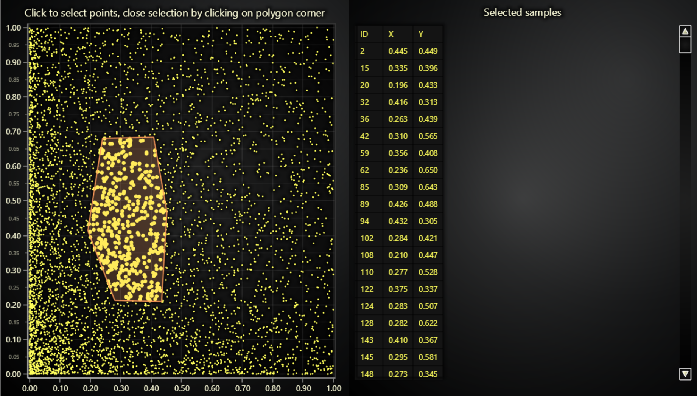

# JavaScript Lasso Selection Chart

This demo application belongs to the set of examples for LightningChart JS, data visualization library for JavaScript.

LightningChart JS is entirely GPU accelerated and performance optimized charting library for presenting massive amounts of data. It offers an easy way of creating sophisticated and interactive charts and adding them to your website or web application.

The demo can be used as an example or a seed project. Local execution requires the following steps:

-   Make sure that relevant version of [Node.js](https://nodejs.org/en/download/) is installed
-   Open the project folder in a terminal:

          npm install              # fetches dependencies
          npm start                # builds an application and starts the development server

-   The application is available at _http://localhost:8080_ in your browser, webpack-dev-server provides hot reload functionality.

## Description

This example showcases the creation of a custom user interaction.

Any custom interaction can be implemented with different event subscription methods.
In this example, `addEventListener` is used to hook on to the event when user clicks mouse button inside the series area.
`PolygonSeries` are used to draw a _lasso selection_ as the user clicks with mouse on the chart.
Finally, after user clicks on any existing polygon point to close it, the data points that are inside the lasso are solved and highlighted using edit data API.

This idea of custom interactions can be extended to any application specific dynamic interaction, like deleting selected points, displaying them in a separate chart or moving them - imagination is the limit!

See also:

-   https://lightningchart.com/js-charts/interactive-examples/examples/lcjs-example-0043-customTimeSelectionInteraction.html

## API Links

* [Lightning chart]
* [Color factory CSS]
* [2D Point shape options]
* [Solid line style]
* [Solid fill style]
* [Chart XY]
* [Point Series 2D]
* [Polygon Series 2D]

## Support

If you notice an error in the example code, please open an issue on [GitHub][0] repository of the entire example.

Official [API documentation][1] can be found on [LightningChart][2] website.

If the docs and other materials do not solve your problem as well as implementation help is needed, ask on [StackOverflow][3] (tagged lightningchart).

If you think you found a bug in the LightningChart JavaScript library, please contact sales@lightningchart.com.

Direct developer email support can be purchased through a [Support Plan][4] or by contacting sales@lightningchart.com.

[0]: https://github.com/Arction/
[1]: https://lightningchart.com/lightningchart-js-api-documentation/
[2]: https://lightningchart.com
[3]: https://stackoverflow.com/questions/tagged/lightningchart
[4]: https://lightningchart.com/support-services/

© LightningChart Ltd 2009-2022. All rights reserved.

[Lightning chart]: https://lightningchart.com/js-charts/api-documentation/v7.0.1/functions/lightningChart-1.html
[Color factory CSS]: https://lightningchart.com/js-charts/api-documentation/v7.0.1/functions/ColorCSS.html
[2D Point shape options]: https://lightningchart.com/js-charts/api-documentation/v7.0.1/enums/PointShape.html
[Solid line style]: https://lightningchart.com/js-charts/api-documentation/v7.0.1/classes/SolidLine.html
[Solid fill style]: https://lightningchart.com/js-charts/api-documentation/v7.0.1/classes/SolidFill.html
[Chart XY]: https://lightningchart.com/js-charts/api-documentation/v7.0.1/classes/ChartXY.html
[Point Series 2D]: https://lightningchart.com/js-charts/api-documentation/v7.0.1/classes/PointSeries.html
[Polygon Series 2D]: https://lightningchart.com/js-charts/api-documentation/v7.0.1/classes/PolygonSeries.html

